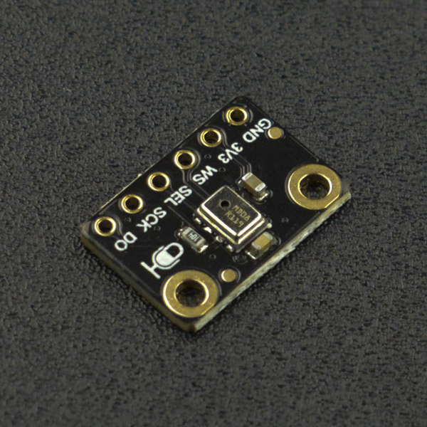

# DFrobot_MSM261
- [英文版](./README.md)

这是一个麦克风的库，库中集成了获取麦克风原始数据、将麦克风数据存储在SD卡中，使用蓝牙传输麦克风数据




## 产品链接（https://www.dfrobot.com.cn）

    SKU：SEN0526

## 目录

  * [概述](#概述)
  * [库安装](#库安装)
  * [方法DFrobot_Microphone](#方法DFrobot_Microphone)
  * [方法DFRobot_BluetoothA2DPSource](#方法DFRobot_BluetoothA2DPSource)
  * [兼容性](#兼容性)
  * [历史](#历史)
  * [创作者](#创作者)

## 概述

* 运行例程可以实时获取麦克风数据
* 运行例程可以通过蓝牙传输麦克风数据
* 运行例程可以将声音数据存储在SD卡中

## 库安装

使用此库前，请首先下载库文件，将其粘贴到\Arduino\libraries目录中，然后打开examples文件夹并在该文件夹中运行演示。

## 方法 DFrobot_Microphone

```C++
  /**
   * @fn begin
   * @brief 初始化设备
   * @param baudRate 通信速率
   * @param bit 数据位数
   * @return 返回初始化状态
   */
  uint8_t begin(uint16_t baudRate,uint8_t bit)

  /**
   * @brief 获取麦克风返回数据
   * @param buffer 获取数据得buffer
   * @param len    获取数据长度
   * @return 返回获取数据长度
   */
  uint32_t read(char *buffer,size_t len)

  /**
   * @brief 构建WAVE文件的头
   * @param header 构建WAVE的文件
   * @param totalDataLen 需要写入的数据长度
   * @param longSampleRate 采样频率
   * @param channels 声道数量
   * @param byteRate 字节速率 计算方式：采样速率x声道数量x数据位数/8
   * @param blockAlign 块对齐方式 计算方式：声道数量x数据位数/8
   */
    void createWavHeader(byte* header, int totalDataLen, int longSampleRate, uint8_t channels, int byteRate, uint8_t blockAlign)
```
## 方法 DFRobot_BluetoothA2DPSource
```C++
  /**
   * @brief 初始化蓝牙和a2dp
   * @param name  蓝牙名称
   * @param callback a2dp发送数据的回调函数
   * @param volume 声音强度
   */
  bool begin(const char* name, esp_a2d_source_data_cb_t callback,uint8_t volume);

```

## 兼容性
MCU                | Work Well    | Work Wrong   | Untested    | Remarks
------------------ | :----------: | :----------: | :---------: | :----:
FireBeetle-ESP32   |      √       |              |             |


## 历史

- 2022/03/03 -1.0.0 版本.

## 创作者

Written by TangJie(jie.tang@dfrobot.com), 2022. (Welcome to our [website](https://www.dfrobot.com/))


